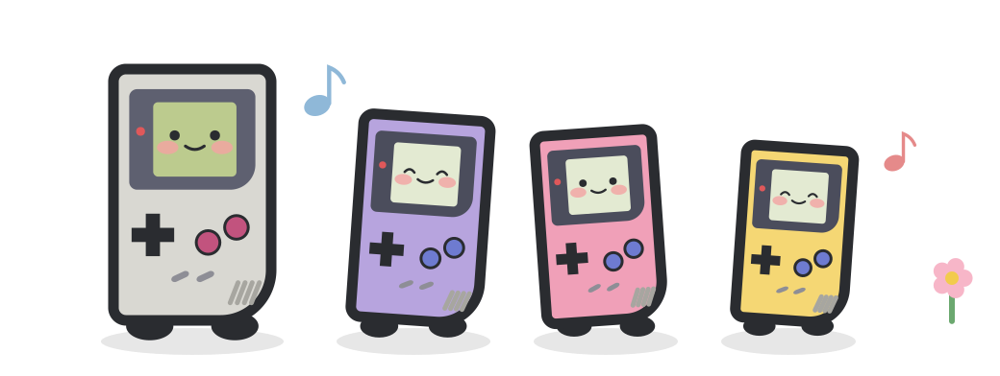
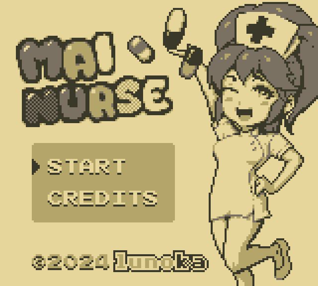
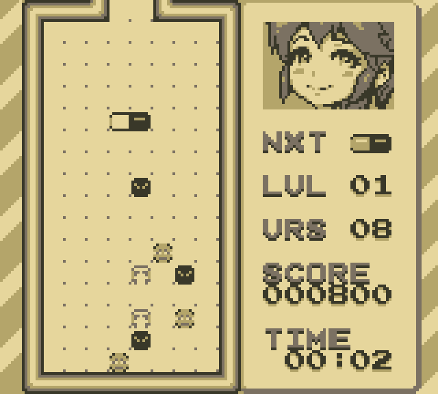
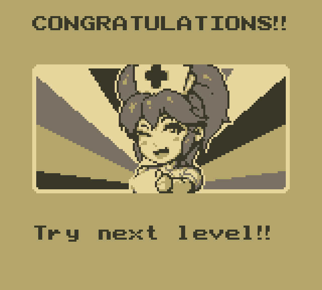
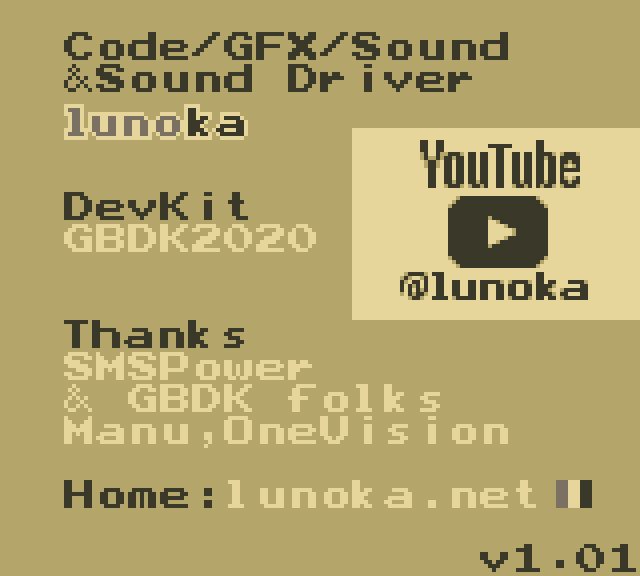

  

<h1 align="center">PopGB</h1>

  
  

  
  
   
  
  

画面は lunoka 氏の <a href="https://lunoka.itch.io/mai-nurse">「Mai Nurse」</a> を PopGB の x1(等倍)表示で動かしたものです(作者の許可を得て掲載。下の「クレジット」を参照)。

**非公式の移植版です。** PopGB は、ゲームボーイ / ゲームボーイカラーのエミュレータ [gnuboy](https://github.com/rofl0r/gnuboy)(Laguna 氏、Gilgamesh 氏ほか)を、SHARP の電子辞書 Brain PW-G5300(Windows CE)向けに移植したものです。gnuboy の公式版ではありません。gnuboy の作者やメンテナーはこの移植に関わっておらず、サポートもしていません。不具合の報告は、上流ではなくこちらにお願いします。

**Unofficial port.** PopGB is an unofficial port of the gnuboy Game Boy / Game Boy Color emulator (by Laguna, Gilgamesh and contributors) to the SHARP Brain PW-G5300 electronic dictionary (Windows CE). It is not an official gnuboy release, and the gnuboy authors and maintainers are not involved in it and do not support it. Please report PopGB issues here, not upstream.

## ダウンロード
最新版は Releases のページからダウンロードできます。
https://github.com/daizu-coder/PopGB/releases/latest

## アプリのインストール
Brainへのインストールは[アプリの起動方法](https://brain.fandom.com/ja/wiki/アプリの起動方法)を参照してください。

## 制作について
コードとマスコットの絵はAI(Claude)で作りました。製作者はプログラムを読めません。

## ライセンスと商標
PopGB 全体は、上流の gnuboy と同じ条件の GNU General Public License バージョン2(GPL-2.0)で配布します。

「ゲームボーイ」「ゲームボーイカラー」「Game Boy」「Game Boy Color」「Nintendo」「任天堂」は任天堂の商標、「SHARP」「Brain」はシャープ株式会社の商標です。PopGB は、これらの権利者とは関係ありません。

ライセンスの詳しい説明は [sys/ce/LICENSING.md](../sys/ce/LICENSING.md) にあります。

ゲームの ROM は同梱していません。

## ビルド方法、使用方法
ビルド方法と使用方法は [sys/ce/README.md](../sys/ce/README.md) をご覧ください。

## クレジット

PopGB は、次の方々の作品を使わせていただいています。ありがとうございます。

- **gnuboy**(エミュレータ本体):Laguna 氏、Gilgamesh 氏ほか(`docs/CREDITS`)。GNU GPL バージョン2(GPL-2.0)。上流は [rofl0r/gnuboy](https://github.com/rofl0r/gnuboy) です。
- **inflate.c**(圧縮された ROM の展開):David Madore 氏。パブリックドメイン。
- **miniz / tinfl**(圧縮された ROM の展開):Rich Geldreich 氏、RAD Game Tools、Valve Software。MIT ライセンス。
- **XZ Embedded**(.xz の ROM の展開):Lasse Collin 氏、Igor Pavlov 氏。パブリックドメイン。
- **東雲フォント(16ドット)**(画面の文字):古川泰之氏ほか、/efont/(電子書体オープンラボ)。実質パブリックドメイン。
- **Galmuri フォント**(画面の文字):Lee Minseo 氏([quiple/galmuri](https://github.com/quiple/galmuri))。SIL Open Font License 1.1。
- **マスコットの絵とアイコン**:AI(Claude)で作りました。CC0 1.0(パブリックドメイン)。
- **スクリーンショットのゲーム**:[「Mai Nurse」](https://lunoka.itch.io/mai-nurse)、作者は lunoka 氏です。作者の許可を得て、この README に掲載しています。スクリーンショットの画像(`.github/screenshots/`)は、このリポジトリのライセンス(GPL-2.0、MIT、CC0 1.0)の対象外で、ゲームの著作権は作者にあります。

それぞれの著作権表示とライセンスの全文は [sys/ce/THIRDPARTY_LICENSES.txt](../sys/ce/THIRDPARTY_LICENSES.txt) にあります。
